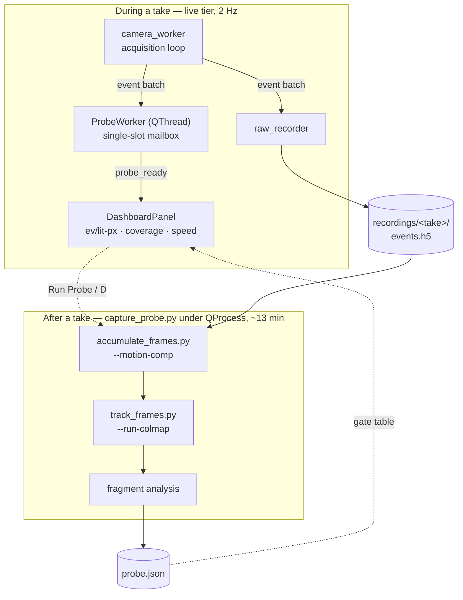

# ThinkCam Capture Dashboard — Implementation Plan

A dashboard in the ThinkCam GUI that closes the capture loop:
**shoot → probe → adjust → shoot again.**

---

## 0. Context

[`Phase1b-Results.md`](../wiki/Phase1b-Results.md) §9 ends with one instruction: re-capture
with bias changes, then re-run the gates. Nothing in the repo supports that loop. The
quantity §9.1 names as the target — events per active pixel — has no implementation
anywhere; the 0.87 ev/px/s and 1.95 ev/active-px figures in the wiki were computed ad hoc
and left no code behind. Biases cannot be changed without editing
`thinkcam/constants.py:14-17` and restarting. And the only end-to-end verdict runs through
COLMAP at ~13 minutes a take, so an operator cannot tell inside a session whether a change
helped.

**The failure mode has also moved since `Phase1b-Results.md` was written**, and the
dashboard should be built against the current one. That document measured the SIFT path:
COLMAP registered 2–3 of 238 frames at mean track length 2.00–2.67. The LK path in
`track_frames.py` — built afterwards, never written up — does substantially better. Its
run survives at `work/phase1b/tracked_mc25k` (200 motion-compensated frames, 25 k events
each, covering 12.0–17.98 s of the 64 s take):

| | fragments | registered | mean track length |
|---|---|---|---|
| SIFT, plain (`sw_200000`) | 1 | 2 / 238 | 2.00 |
| SIFT, compensated (`mccold_200000`) | 1 | 3 / 238 | 2.67 |
| **LK tracks (`tracked_mc25k`)** | **12** | 2–37 each | **3.07–4.37 in 11 of 12** |

The track-length gate now passes. What fails is that the mapper produces **twelve
disconnected models** instead of one; the largest (`sparse/4`, 37 images, track length
3.53) spans frames `f000030`–`f000066` — **1.04 seconds of a 64-second capture.** The
binding constraint is now how far a single reconstruction reaches before it breaks, and
that is what the dashboard must foreground.

---

## 1. Design



**Why the full probe is a separate CLI rather than in-process GUI code.** The GUI venv
carries `arena_api` + PySide6; the analysis tools need numpy/h5py/cv2 and the `colmap`
binary, and those live in `~/envs/phase1` (numpy 2.5.2, h5py 3.16.0, cv2 5.0.0, torch
2.13.0+cu130). The GUI must shell out to a configurable analysis interpreter. Keeping it
a root-level CLI also leaves it usable from a terminal with no camera attached, matching
the existing tool family.

**Events per lit pixel needs two windows, not one.** Measured on the take every wiki
number came from, at the same start index as `tracked_mc25k`:

| window | exposure | lit pixels | ev/lit-px | multi-hit share |
|---|---|---|---|---|
| 25 k (the LK pipeline window) | 0.026 s | 2.5% | **1.07** | 12.1% |
| 200 k (the SIFT-era window) | 0.244 s | 17.9% | **1.21** | 29.8% |
| 1.6 M | 1.834 s | 80.9% | **2.15** | 82.5% |

A 64× longer window buys 2× the density — because the camera is moving, extra time paints
a wider swath rather than building up the same pixels, which is `Phase1b-Results.md` §7's
closing finding, now reproducible in one command. Two consequences:

- A `≥5` gate at the 25 k pipeline window would be unreachable by construction and
  therefore useless. The panel reports ev/lit-px at **both** the pipeline window and a
  fixed **2 s reference window**, and hangs the §9.1 `≥5` gate on the reference (where
  today's take reads 2.15, against the 1.95 on record — the numbers line up).
- Because the value barely moves with window length, it is close to a pure sensor
  property. That is exactly what makes it the right live readout for a bias change.

**Pipeline window pinned to 25 000 events, motion compensation on.** Both come from
`tracked_mc25k/frames.json`, the best-performing configuration on record. This is a
correction to `Phase1b-Results.md`, which used 200 k and concluded compensation was not
worth 1.7× the cost — that held for the SIFT path, not the LK one.

---

## 2. `capture_probe.py` (new, in `pipeline/`)

Orchestrates the full pipeline on a finished take. Always runs everything; no tiers.

```
python -m pipeline.capture_probe --input recordings/<session> [--out work/probe/<take>]
    --events-per-frame 25000      # PROBE_EVENTS_PER_FRAME
    --stride 25000
    --start-s / --duration-s      # optional segment
    --no-motion-comp              # escape hatch; compensation is ON by default
    --skip-colmap                 # mechanics-only run
    --json probe.json
```

Each step shelled out, stdout+stderr tee'd to `<out>/<step>.log`:

1. `pipeline.accumulate_frames --input <rec> --out <out>/input --motion-comp` — frames.
2. `pipeline.track_frames --frames <out> --out <out> --run-colmap` — LK tracks, then COLMAP via
   `feature_importer` / `matches_importer` / `mapper`, which it already drives itself
   (`pipeline/track_frames.py:228-236`).
3. Fragment analysis (new, §4) over every `<out>/sparse/*` model.

Then one table and one `probe.json`:

| Stat | Source | Gate |
|---|---|---|
| ev/lit-px @ pipeline window | new (§3) | informational |
| ev/lit-px @ 2 s reference | new (§3) | ≥ 5.0 (`Phase1b-Results.md` §9.1) |
| Lit coverage % | new (§3) | informational |
| Camera speed (px/s) | `accumulate_frames.estimate_motion` | informational |
| Feature lifetime (s) | `track_frames`, new field (§4) | ≥ 3 × frame_dt |
| **Fragments** | new (§4) | **1** |
| **Frames in largest model** | new (§4) | ≥ 90% of input |
| **Span of largest model (s)** | new (§4) | vs take duration (now 1.04 / 64 s) |
| Mean track length (largest) | `colmap model_analyzer` | > 3.0 |

Follow the family reporting idiom — the `# ---- Report (print chosen conventions...)`
block at `pipeline/convert_to_inceventgs.py:252` — printing a banner that restates window, stride,
compensation and `norm_hi` actually used, then the gate table via `frame_metrics._fmt`
(`pipeline/frame_metrics.py:72`), which already formats `[PASS]`/`[FAIL]` lines. Writing
`probe.json` is a deliberate departure from the family's stdout-only habit, because the
GUI needs a machine-readable result; the human report stays primary.

Reuse rather than reimplement: `_resolve_input` (`pipeline/convert_to_inceventgs.py:47`, the single
canonical path resolver used by every tool), `resolve_geometry`
(`pipeline/export_e2vid_input.py:68`), `event_chunks` (`pipeline/export_e2vid_input.py:85`, the canonical
streaming read — never `load_events`, which slurps 676 MB), `accumulate`
(`pipeline/accumulate_frames.py:93`), `_fmt` and `load_frames` (`pipeline/frame_metrics.py:72`, `:80`).

**Runtime.** `/usr/bin/colmap` is 3.12.6 built **without CUDA**, so the mapper is CPU-only
regardless of the healthy RTX 5080 — every existing script already passes
`--SiftExtraction.use_gpu 0`. The ~13 min is structural until a CUDA-enabled colmap is
installed; note it in the panel's progress line so the wait is not mistaken for a hang.

---

## 3. Live tier

### `thinkcam/probe_worker.py` (new)

A `QThread` with a **single-slot mailbox** — newest batch wins, older ones dropped, the
same "NewestOnly" discipline `camera_worker.py:70` applies to stream buffers. This is what
keeps the estimator off the acquisition thread, which must sustain ~1.7 k buffers/s while
`estimate_motion` at `grid=9, levels=6` costs ~486 objective evaluations.

- `submit(batch)` — called from the acquisition loop, non-blocking, overwrites the slot.
- Keeps a rolling deque trimmed to the 2 s reference window, and slices the pipeline
  window off its tail, so both readings come from one buffer (~26 MB at 798 Kev/s).
- Emits `probe_ready = Signal(dict)` at `PROBE_UPDATE_HZ` (2 Hz).

All from existing primitives:

- `counts = accumulate_frames.accumulate(x, y, width, height)` (`pipeline/accumulate_frames.py:93`)
  — the `np.bincount(y*width + x)` unsigned-count image. Then `lit = (counts > 0).sum()`,
  `ev_per_lit = counts.sum() / lit`, `lit_coverage = lit / (width * height)`.
- `speed = hypot(*estimate_motion(...)[:2])` on a `subsample(n, 30_000)` slice
  (`pipeline/accumulate_frames.py:183`). `estimate_motion` carries the spatial-binning fix from
  `Phase1b-Results.md` §4, without which it returns `v ≈ 0` on this data — do not
  reimplement the search.

`render_events` (`visualizer.py:9`) cannot supply any of this: it is a last-writer-wins
scatter into a BGR image and has no per-pixel counts.

### `thinkcam/dashboard.py` (new) — `DashboardPanel(QWidget)`

Fed the way `DerivativePlotWindow` (`derivative_plot.py`) is, but embedded rather than a
popup. Two sections:

- **Live** — ev/lit-px at both windows, lit coverage, camera speed; each value coloured
  against its gate. Driven by `probe_ready`.
- **Last probe** — the gate table from `probe.json`, a `Run Probe` button, a progress
  line, and the take name. Greyed until a probe has run.

### Wiring

- `main_window.py:62-85` `_build_ui`: the central `QHBoxLayout` is
  `[viewport(stretch=1), ControlPanel(200px)]`. Wrap the right column in a `QVBoxLayout`
  holding `ControlPanel` then `DashboardPanel`; widen to ~260 px.
- Batches reach the probe worker **from the acquisition loop**, beside the existing
  `self.raw_recorder.submit(events)` at `camera_worker.py:175` — not from `_on_frame`,
  which receives a rendered BGR image rather than events.
- `_toggle_raw_recording`: on stop, keep the returned session dir and enable `Run Probe`
  for it. Bind `D` to run the probe (`S`/`P`/`R`/`Q`/`Esc` are taken,
  `main_window.py:102-107`).
- Run the probe under `QProcess` so the GUI survives a 13 min COLMAP pass; stream its
  stdout into the progress line.

---

## 4. New metrics in the existing tools

Kept in the CLI tools rather than the GUI, so they stay independently useful.

**Fragment analysis — the metric this plan is really about.** `find_sparse`
(`pipeline/frame_metrics.py:393`) returns whichever `sparse/*` dir holds the largest `images.*`
file, and `cmd_colmap` (`:412`) then reports `registered / n_input`. Against
`tracked_mc25k` that yields "37/200, track 3.53" and never reveals that eleven other
models exist — it reads as a registration failure when it is a connectivity failure. Add
`analyze_fragments(scene, frames_dir)`:

- enumerate every `<scene>/sparse/*` containing `images.bin`/`images.txt`;
- for each, run `colmap model_analyzer` and regex-parse it exactly as `cmd_colmap`
  already does (`:422-424`);
- read registered image names with `view_sparse.load_model` (`pipeline/view_sparse.py:39`, which
  parses `images.txt` and converts `.bin` via `colmap model_converter`);
- map names to `t_mid_s` through `load_frames` (`pipeline/frame_metrics.py:80`) and report each
  fragment's time span, plus the union coverage across all fragments.

Surface it as `pipeline.frame_metrics fragments --scene <dir> --frames <dir>` and reuse it from
`capture_probe.py`. Extend `cmd_colmap` to print the fragment count alongside its existing
output so the single-model assumption stops being silent.

**Feature lifetime in seconds.** `track_frames.export()` (`:114`) reports
`track_len_mean` in *frames* (`:167`). Add `track_lifetime_s_mean` / `_median`, converting
observation frame indices to `t_mid_s` via the `items` list it already holds, into the
`stats` dict written to `tracks.json`. Note `tracked_mc25k` has no `tracks.json` — that
run predates the dump, so the probe regenerates it.

---

## 5. Runtime bias controls

`_configure_noise_filters` (`camera_worker.py:79-95`) writes four nodes once at stream
start from `constants.py:14-17` and never reads them back.

- **`controls.py`** — a `Biases` group: `QSpinBox` for `BiasEventThresholdPositive`,
  `BiasEventThresholdNegative`, `BiasRefractoryPeriod`, `QCheckBox` for
  `EventBurstFilterEnable`, seeded from the constants. One new signal
  `bias_changed = Signal(dict)`. Disable the group while raw recording — the sidecar
  records one bias set per take, so a mid-take change would make it a lie.
- **`camera_worker.py`** — a pending-bias mailbox guarded by the existing `self._lock`
  (`:31`), drained at the top of the acquisition loop, since nodemap writes must happen on
  the thread owning the device. Factor the write loop out of `_configure_noise_filters`
  into `_apply_biases(nm, settings)` and call it from both paths. Add the live values to
  the `stats` dict (`camera_worker.py:194-202`) so the panel shows what is actually in
  effect.
- **`raw_recorder.py`** — `_write_metadata` (`:231-246`) hardcodes the four constants into
  the `biases` block. Once biases are adjustable that is silently wrong: all nine existing
  takes record `10/10/10/true` because that is all the code can say. Add a `biases: dict`
  argument to `start()` and write the live values.

### `VERIFY-FIRST` — are the bias nodes writable while streaming?

Every existing write happens before `device.start_stream()`; nothing writes mid-stream.
IMX636 biases are generally live-writable, but ArenaSDK may mark the nodes read-only while
acquiring. **Confirm on hardware before building the UI around it** — check
`nm[node].is_writable` while streaming. If they are locked, the fallback is a
stop/reconfigure/start cycle, which must be refused outright while raw recording. Record
the finding in the `controls.py` docstring using the ledger idiom of the root scripts
(`pipeline/convert_to_inceventgs.py:1-32`).

Second unknown: each node's legal range. Seed the spinboxes from `node.min`/`node.max` read
at connect time, falling back to the constants if the read fails — the existing code
already wraps every nodemap access in try/except.

---

## 6. New constants (`thinkcam/constants.py`)

```python
PROBE_EVENTS_PER_FRAME = 25_000    # tracked_mc25k/frames.json — best config on record
PROBE_STRIDE           = 25_000    # no overlap, as that run used
PROBE_MOTION_COMP      = True
PROBE_REFERENCE_S      = 2.0       # long window for the comparable ev/lit-px reading
PROBE_EV_PER_LIT_TARGET = 5.0      # Phase1b-Results §9.1, against the reference window
PROBE_UPDATE_HZ        = 2.0
PROBE_MOTION_SEARCH_EVENTS = 30_000
PROBE_WORK_DIR         = "work/probe"
PROBE_PYTHON = os.environ.get(
    "THINKCAM_PROBE_PYTHON", os.path.expanduser("~/envs/phase1/bin/python")
)
```

The GUI venv cannot run the analysis tools. If `PROBE_PYTHON` is missing, the panel
disables `Run Probe` and says why rather than failing at subprocess time.

---

## 7. Build order

Strictly sequential — each step is verifiable before the next depends on it.

1. **§4 fragment analysis.** Pure CLI, no camera, immediately checkable against
   `tracked_mc25k`. It also produces the first honest picture of the current state.
2. **§2 `capture_probe.py`.** Wraps the existing tools plus step 1.
3. **§3 live tier.** Needs hardware to validate, but `ProbeWorker`'s statistics can be
   unit-tested against an `events.h5` slice without a camera.
4. **§5 bias controls.** Gated on the `VERIFY-FIRST` hardware question.

---

## 8. Verification

**§2 — regression against the recorded result, no camera needed.** The probe must
reproduce `tracked_mc25k` before it is trusted on a new take:

```bash
~/envs/phase1/bin/python -m pipeline.capture_probe \
    --input recordings/20260602_102004_demo_scene_orbit_1 \
    --start-s 12 --duration-s 6 --out work/probe/regress
```

Expect 12 fragments, a largest fragment of ~37 frames spanning ~1.04 s at mean track
length ~3.53, ev/lit-px ≈ 1.07 at the 25 k window and ≈ 2.15 at the 2 s reference. Those
are measured values, not estimates — a material difference means the window is not pinned
as intended.

**§4 — fragment analysis.** `pipeline.frame_metrics fragments --scene
work/phase1b/tracked_mc25k --frames work/phase1b/tracked_mc25k` must enumerate all twelve
and match the per-fragment registered counts (2, 15, 22, 24, 17, 13, 37, 11, 27, 10, 10,
17). Cross-check the new lifetime field against the ~0.4 s `pipeline/track_frames.py:17` records.

**§3 — live tier, on hardware.** Static scene: speed near zero, ev/lit-px at its floor.
On an orbit: speed in the 500–2200 px/s band `Phase1b-Results.md` §5 measured. Critically,
confirm acquisition is unaffected — the status bar's dropped-events counter stays 0 and
GVSP FPS does not fall while the panel updates. That is the entire reason the estimator
sits on its own thread.

**§5 — biases.** Settle the writable-while-streaming question first. Then raise
`BIAS_THRESHOLD_POS`/`NEG` and confirm the live event rate falls while ev/lit-px moves;
that pairing is the point of the whole loop. Record a short take and confirm
`metadata.json`'s `biases` block reflects the UI, not the constants.

**End to end.** One session: shoot, read the panel, adjust a bias, reshoot, and confirm
the two `probe.json` files differ in reference-window ev/lit-px in the direction the bias
change predicts — and that fragment count falls as it rises.

---

## 9. Notes for whoever picks this up

- **`work/phase1b/tracked_mc25k` is undocumented.** It is the best result the project has
  and it exists only as scratch in a gitignored directory, with no wiki page and no
  `tracks.json`. `Phase1b-Results.md` §9 recommends re-capture on the strength of numbers
  this run has already improved on. Writing it up — as `wiki/Phase1c-Tracking.md`, or an
  addendum — should probably precede or accompany this work, because it changes what the
  dashboard is for.
- **The `≥5` target in `Phase1b-Results.md` §9.1 has no stated window** and is only
  meaningful with one attached. This plan attaches it to a 2 s reference; if that is not
  the intent, the gate value needs revisiting rather than the code.
- **Fragmentation may not be a density problem at all.** Twelve models each with healthy
  track length is the signature of tracks that die and restart, not of tracks that are
  too short. `pipeline/track_frames.py:17` records a ~0.4 s track lifetime; the largest fragment
  spans 1.04 s. Worth checking whether wider LK windows, overlapping accumulation stride,
  or `--max-gap` tuning merges fragments *before* concluding the sensor is the limit.
